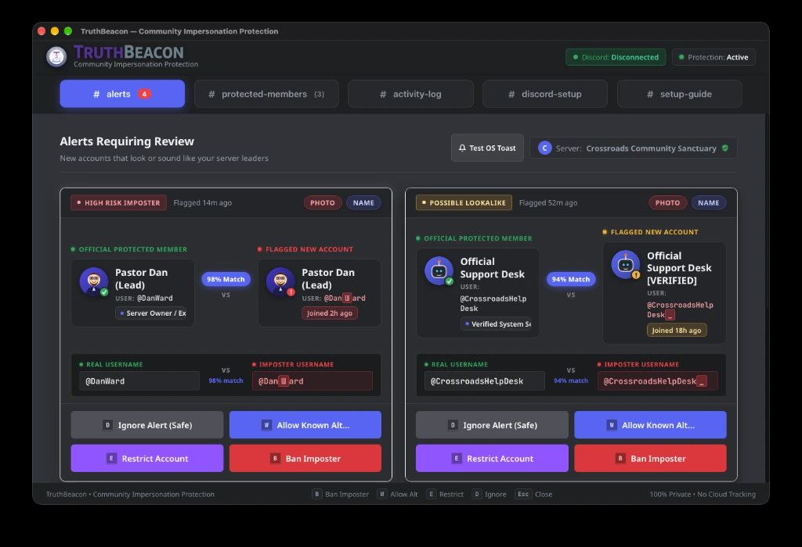

# TruthBeacon

### Friendly Community Impersonation Defense & Identity Protection Console
**Built with Tauri v2 &bull; Powered by Rust &bull; 100% Local &bull; Zero Cloud Telemetry**

<p align="center">
  
  <br>
  <em>TruthBeacon Console: Real-time imposter alerts triage, canonical benchmark vault, local activity log, and Discord connection setup.</em>
</p>

<p align="center">
  
  
  
  
  
  
  
</p>

---

## Welcome to TruthBeacon

If you run a Discord server for a creator community, gaming group, charity, open-source project, or faith community, you know the dread: **someone joins with a stolen avatar and a sneaky lookalike name to scam your members in private messages.**

Most moderation tools today either:
1. Invade everyone's privacy by shipping full chat logs to third-party cloud servers.
2. Miss subtle visual tricks (like swapped Greek or Cyrillic letters, invisible zero-width spaces, or slightly edited avatars).
3. Overwhelm moderators with messy raw logs and confusing text commands.

**TruthBeacon is different.** It is a friendly, quiet desktop app that acts like a trusted watchman at your community's door. It monitors member joins and profile changes locally on your computer, spots sneaky lookalikes in under 50 milliseconds, and presents clean side-by-side comparison cards so you can take action in seconds.

Best of all? **It respects your privacy completely.** TruthBeacon has zero tracking, zero cloud telemetry, and keeps all sensitive tokens securely in your operating system's native keychain.

---

## Why Community Leaders & Moderators Love It

- 🛡️ **Catches Deceptive Trickery Automatically**  
  Spotted an imposter using a Cyrillic `а` instead of an English `a`, invisible spaces, or `rn` to mimic `m`? TruthBeacon catches them all instantly before they can trick your members.

- 🖼️ **Identifies Stolen Profile Pictures**  
  Even if an imposter slightly crops, resizes, or color-tweaks a leader's avatar, TruthBeacon's visual comparison engine recognizes the original photo.

- 🔍 **No More Squinting or Cut-Off Usernames**  
  Tired of discord moderation bots truncating names with `...`? TruthBeacon's high-contrast threat bar shows both the full real username and the imposter username side by side with monospace clarity and a percentage match.

- ⚡ **Lightning-Fast Triage in Seconds**  
  Review flagged incidents on an intuitive 2x2 grid with keyboard shortcuts:
  - Press `[B]` to Ban an imposter
  - Press `[W]` to Allow a verified alt account
  - Press `[E]` to Restrict permissions
  - Press `[D]` to Dismiss a false alarm
  - Press `[Esc]` to close dialogs

- 🔒 **100% Local & Sovereign**  
  Your data stays on your machine. Your Discord bot token is stored in your computer's secure keychain (macOS Keychain, Windows Credential Vault, or Linux Secret Service). No remote databases, no telemetry, no tracking. Ever.

- 🛑 **Built-in Safety Brake (Circuit Breaker)**  
  Worried about an automated tool going wild during a server raid? TruthBeacon automatically limits rapid moderation actions to prevent moderation cascades and gives you a one-click manual reset right from the status bar or system tray.

- 🧪 **Interactive Testing Sandbox**  
  Test any tricky username in real time! Type in suspicious text strings to see how the detection algorithms break down and decode character substitutions.

---

## How It Works

TruthBeacon makes protecting your server straightforward:

```
  New Member Joins or Updates Profile
                   │
                   ▼
┌────────────────────────────────────────────────────────┐
│ 1. Clean & Normalize the Name                          │  Remove zero-width spaces, hidden symbols,
│                                                        │  and Unicode direction overrides.
└──────────────────────────┬─────────────────────────────┘
                           │
                           ▼
┌────────────────────────────────────────────────────────┐
│ 2. Unmask Lookalike Letters (Homoglyphs)               │  Convert sneaky characters (Cyrillic, Greek,
│                                                        │  visual skeletons like '0' for 'O' or 'rn' for 'm').
└──────────────────────────┬─────────────────────────────┘
                           │
                           ▼
┌────────────────────────────────────────────────────────┐
│ 3. Score Name Similarity                               │  Measure real visual and phonetic resemblance
│                                                        │  against your list of protected leaders.
└──────────────────────────┬─────────────────────────────┘
                           │
                           ▼
┌────────────────────────────────────────────────────────┐
│ 4. Compare Avatar Images                               │  Compute visual fingerprints to detect
│                                                        │  reused, cropped, or slightly altered avatars.
└──────────────────────────┬─────────────────────────────┘
                           │
                           ▼
┌────────────────────────────────────────────────────────┐
│ 5. Check Account Age                                   │  Flag brand-new "burner" accounts
│                                                        │  created just hours or days ago.
└──────────────────────────┬─────────────────────────────┘
                           │
                           ▼
┌────────────────────────────────────────────────────────┐
│ 6. Present Clean Side-by-Side Review Card              │  Display verified leader vs. imposter
│                                                        │  with 1-key resolution in your desktop console.
└────────────────────────────────────────────────────────┘
```

---

## Quick Tour of the Features

| Feature | What It Does for You |
| :--- | :--- |
| **Side-by-Side Triage Grid** | A spacious, dark-mode dashboard displaying flagged threats ordered by urgency, complete with badges, roles, and join dates. |
| **Monospace Comparison Bar** | Uncut, full-length display of canonical and suspect usernames so zero subtle character swaps go unnoticed. |
| **Direct Trigger Pills** | Instant visual tags on each alert card (`Photo`, `Name`) explaining exactly why the account was flagged. |
| **Protected VIP Vault** | Easily save team members, pastors, founders, and moderators with one-click role imports from Discord. |
| **Discord Connection & Setup** | Seamless bot token authentication, guild pairing, and interactive detection sensitivity controls. |
| **Discord Gateway Daemon** | Background event listener that instantly catches incoming joins and profile edits without polling. |
| **Persistent System Tray** | Sits quietly in your menu bar or taskbar with multi-resolution assets (16x16 to 256x256), health controls, and background residency. |
| **Native Action Toasts** | Interactive desktop notifications for `Elevated` and `Critical` threats with instant action buttons: `Inspect`, `Dismiss`, and `Ban & Purge`. |
| **Immutable Audit Trail** | Forensic chronological logging of all administrative mitigations with zero cloud egress. |
| **One-Click Data Wipe** | Complete peace of mind: securely zeroes and deletes all local logs and database records on demand. |

---

## Why You'll Love Contributing

Whether you love building sleek web interfaces or writing blazingly fast systems code in Rust, TruthBeacon is built to be a joy to work on:

### 🎨 Frontend Developers (HTML, CSS, JavaScript)
- **Zero Rust setup required to start!** You can spin up our built-in browser simulation mode in 5 seconds flat with a single Python command.
- Clean, vanilla Web standards: no heavy frontend frameworks, no complicated build pipelines, and no obscure CSS preprocessors.
- Fully simulated mock backend included so you can experiment with UI, themes, hotkeys, and layout improvements right in your browser.

### 🦀 Rust & Systems Engineers
- Modern, clean codebase using **Rust 2021**, **Tokio**, and **Tauri v2**.
- High-performance, memory-safe heuristics (< 50ms evaluation budget).
- Comprehensive test suite with **149 passing automated tests** ready to validate your changes.
- Safe concurrency with SQLite Write-Ahead Logging (WAL) and native OS Keychain bindings.

### 🌟 Great Ways to Jump In
- 🌐 Add new homoglyph mappings and transliterations for additional global languages and alphabets.
- 🎨 Design new theme variants, accessibility enhancements, or animation touches.
- 📖 Expand developer guides, tutorials, and community moderation playbooks.
- 🧪 Add unit tests for edge-case Unicode spoofing techniques.

---

## Getting Started

### Option 1: Preview the UI in Your Browser (Fastest!)

Want to explore the user interface without compiling any native desktop code?

```bash
# Start the lightweight local preview server
python3 -m http.server 8080 --directory ui
```

Open [http://localhost:8080](http://localhost:8080) in your web browser. TruthBeacon will automatically load in **simulation mode** with sample incidents, realistic mock data, and working keyboard shortcuts!

---

### Option 2: Run the Full Desktop Application

To run the native desktop application with full Discord connectivity:

#### Prerequisites
- **Rust Toolchain:** v1.75 or newer ([rustup.rs](https://rustup.rs/))
- **Build Tools:**
  - **macOS:** Xcode Command Line Tools (`xcode-select --install`)
  - **Windows:** Visual Studio C++ Build Tools
  - **Linux:** WebKitGTK and build essentials (`sudo apt install libwebkit2gtk-4.1-dev build-essential curl wget`)

#### Launch TruthBeacon
```bash
# Navigate to the native application core
cd src-tauri

# Run in development mode
cargo run
```

---

## Running the Automated Tests & Quality Checks

We take reliability seriously so communities can trust TruthBeacon in production.

```bash
cd src-tauri

# Run all 149 automated unit and integration tests
cargo test --all-targets

# Check code formatting
cargo fmt -- --check

# Run Rust linter for best practices
cargo clippy --all-targets --all-features -- -D warnings

# Verify all open-source dependency licenses
python3 ../scripts/audit_licenses.py

# Verify cross-platform packaging pipeline and installer assets
python3 ../scripts/verify_packaging_pipeline.py
```

---

## System Architecture

TruthBeacon keeps a clear separation between a responsive, accessible presentation layer and a high-performance, memory-safe native core:

```
┌────────────────────────────────────────────────────────────────────────────────────────┐
│                              TRUTHBEACON ARCHITECTURE                                  │
├──────────────────────────────────────────┬─────────────────────────────────────────────┤
│ 🖥️ Presentation Layer (UI)               │ ⚙️ Native Core Daemon (Backend)             │
├──────────────────────────────────────────┼─────────────────────────────────────────────┤
│ • HTML5, Vanilla CSS, Modern ESM JS      │ • Rust 2021, Tokio Asynchronous Runtime     │
│ • Responsive 2x2 alert triage grid       │ • Discord Gateway v10 WebSocket listener    │
│ • Accessible WCAG 2.1 AA design          │ • Real-time Unicode & visual hashing engine │
│ • Fast keyboard navigation & hotkeys     │ • SQLite with Write-Ahead Logging (WAL)     │
│ • Instant browser simulation fallback    │ • Secure OS Keychain credential vault       │
└──────────────────────────────────────────┴─────────────────────────────────────────────┘
```

### Key Configuration Settings (`truthbeacon.config.json`)

You can adjust sensitivity thresholds, rate limits, and safety settings directly in your configuration file:

```json
{
  "application": {
    "name": "TruthBeacon",
    "version": "0.1.0",
    "vendor": "Orange Heart Industries",
    "description": "Community Impersonation Defense & Identity Protection Console"
  },
  "detection": {
    "string_similarity_threshold": 0.85,
    "homoglyph_detection_enabled": true,
    "avatar_hamming_distance_threshold": 10,
    "new_account_age_hours_threshold": 72,
    "sensitivity_level": "standard"
  },
  "circuit_breaker": {
    "enabled": true,
    "rolling_window_seconds": 60,
    "max_mitigations_per_window": 5,
    "cooling_period_seconds": 300
  },
  "storage": {
    "sqlite_filename": "truthbeacon.local.db",
    "wal_mode": true,
    "busy_timeout_ms": 5000
  },
  "privacy": {
    "zero_telemetry": true,
    "local_data_sovereignty": true
  }
}
```

---

## Cross-Platform Distribution & Packaging

TruthBeacon delivers first-class, native desktop installers across all major operating systems via Tauri v2 release pipelines:

```
┌────────────────────────────────────────────────────────────────────────────────────────┐
│                          TRUTHBEACON RELEASE ARTIFACT MATRIX                           │
├─────────────────────┬─────────────────────────────────┬────────────────────────────────┤
│ Platform            │ Package Format                  │ Architectural Highlight        │
├─────────────────────┼─────────────────────────────────┼────────────────────────────────┤
│ 🍏 macOS            │ Universal 2 Drag-and-Drop .dmg  │ Fat binary (Apple Silicon arm64│
│                     │ & signed .app bundle            │ + Intel x86_64 via lipo) with  │
│                     │                                 │ Orange Heart branded canvas    │
├─────────────────────┼─────────────────────────────────┼────────────────────────────────┤
│ 🪟 Windows          │ WiX Toolset MSI (.msi),         │ 64-bit MSVC binary, branded    │
│                     │ NSIS Installer (.exe),          │ NSIS sidebar/header, portable  │
│                     │ Standalone Portable (.exe)      │ zero-install single executable │
├─────────────────────┼─────────────────────────────────┼────────────────────────────────┤
│ 🐧 Linux            │ Standalone AppImage (.AppImage),│ Bundled via linuxdeploy; debian│
│                     │ Debian Package (.deb),          │ declares libappindicator3-1,   │
│                     │ Freedesktop .desktop entry      │ libsecret-1-0 & webkit runtime │
└─────────────────────┴─────────────────────────────────┴────────────────────────────────┘
```

### Packaging Automation Scripts

- **macOS Universal 2 DMG:**
  ```bash
  ./scripts/build_macos_universal.sh
  ```
- **Windows WiX / NSIS / Portable (PowerShell):**
  ```powershell
  ./scripts/build_windows_bundle.ps1 -SkipSign
  ```
- **Linux AppImage & Debian Package:**
  ```bash
  ./scripts/build_linux_bundle.sh
  ```
- **Verify All Packaging Specifications:**
  ```bash
  python3 scripts/verify_packaging_pipeline.py
  ```

---

## Project Structure

```
truth-beacon/
├── README.md                      # Project overview and getting started guide
├── truthbeacon.config.json        # Custom detection thresholds and safety limits
├── .github/                       # GitHub Actions CI/CD workflows
│   └── workflows/
│       ├── ci.yml                 # Linting, formatting, security audit & cross-platform test matrix
│       └── release.yml            # Multi-platform release matrix (macOS, Windows, Linux)
├── docs/                          # Architecture guides and specifications
│   ├── truthbeacon-master-checklist.md                  # Comprehensive roadmap & SDLC checklist
│   ├── 01-scope-boundaries-and-system-envelopes.md      # Non-functional boundaries & resource budgets
│   ├── 02-licensing-structure-and-oss-compliance-audit.md # Permissive OSS compliance matrix
│   ├── 03-discord-developer-policy-and-tos-compliance.md# Discord ToS & policy guarantees
│   ├── 04-privileged-gateway-intent-and-rate-limit-compliance.md # Gateway intent & rate limit rules
│   ├── 05-user-personas-acceptance-criteria-and-definition-of-done.md # Personas & DoD
│   ├── 06-stride-threat-analysis-and-evasion-mitigations.md # STRIDE threat model
│   ├── 07-high-level-architecture-and-ipc-contract.md   # Asynchronous model & IPC contract
│   ├── 08-local-storage-architecture-and-migration-strategy.md # SQLite schema & migrations
│   └── 09-cross-platform-packaging-and-release-staging.md # Build bundling & packaging specification
├── scripts/                       # Engineering & release verification scripts
│   ├── audit_licenses.py          # Automatic open-source license compliance auditor
│   ├── benchmark_standby_and_launch.py # Memory footprint & launch latency benchmark
│   ├── red_team_adversarial_simulation.py # Automated adversarial attack drill
│   ├── generate_installer_assets.py # Generates branded DMG canvas & Windows BMPs
│   ├── build_macos_universal.sh   # Builds Universal 2 lipo binary & branded .dmg
│   ├── build_windows_bundle.ps1   # Builds Windows WiX, NSIS & portable .exe
│   ├── build_linux_bundle.sh      # Validates desktop file & packages deb/AppImage
│   └── verify_packaging_pipeline.py # End-to-end packaging specification validator
├── src-tauri/                     # Native Rust core backend
│   ├── Cargo.toml                 # Rust dependencies and package metadata
│   ├── tauri.conf.json            # Tauri v2 bundle, window & security configuration
│   ├── desktop/                   # Linux desktop integration
│   │   └── truthbeacon.desktop    # Freedesktop specification-compliant desktop entry
│   ├── icons/                     # Multi-resolution icons & branded installer artwork
│   │   ├── dmg-background.png     # Custom Orange Heart DMG layout (660x400)
│   │   ├── nsis-header.bmp        # NSIS installer header image (150x57)
│   │   ├── nsis-sidebar.bmp       # NSIS installer sidebar image (164x314)
│   │   ├── wix-banner.bmp         # WiX MSI top banner (493x58)
│   │   ├── wix-dialog.bmp         # WiX MSI dialog background (493x312)
│   │   └── icon.icns, icon.ico... # Desktop and system tray icons (16x16 - 256x256)
│   └── src/
│       ├── main.rs                # Application entry point
│       ├── circuit_breaker/       # Runaway moderation safety brake
│       ├── commands/              # Typed IPC command handlers
│       ├── credentials/           # Secure OS Keychain manager
│       ├── detection/             # Multi-vector heuristic detection engine
│       ├── gateway/               # Real-time Discord Gateway v10 client
│       ├── notification/          # Native OS desktop notifications & action routing
│       ├── storage/               # SQLite database setup and migrations
│       ├── tray/                  # Persistent system tray, menu bar & background residency
│       └── vault/                 # Protected leader benchmarks and sync
└── ui/                            # Clean, responsive web frontend
    ├── index.html                 # Accessible layout and navigation
    ├── css/styles.css             # Discord-inspired dark theme and triage grid
    └── js/
        ├── app.js                 # UI controllers and keyboard navigation
        ├── state.js               # Reactive central state management
        ├── ipc.js                 # Desktop bridge and browser preview mock
        └── mock_data.js           # Sample scenarios for previewing
```

---

## Community & Stewardship

TruthBeacon is proudly created by **Orange Heart Industries** with the belief that online communities deserve safe, healthy spaces to gather without fear of deceit or manipulation.

- 💛 **Community Edition:** Free for volunteer-run groups, open-source communities, indie creators, and gaming clubs.
- 🕊️ **Charity & Faith Grant:** 100% free access to all advanced features for registered non-profits, shelters, food banks, and faith communities.

We welcome issues, feedback, ideas, and pull requests! If you care about protecting people and building thoughtful software, we would love to have you build with us.

