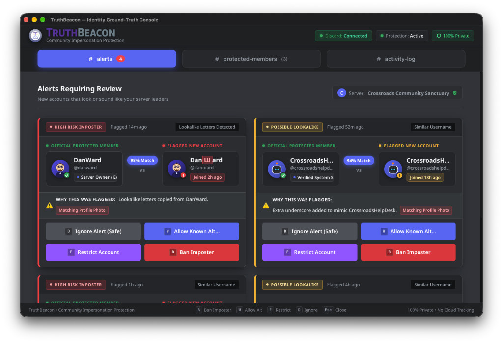

# TruthBeacon: Desktop Identity Ground-Truth & Impersonation Prevention Console
### Community Impersonation Protection Console • Tauri v2 • Rust Core • Zero Cloud Telemetry

<p align="center">
  
</p>

<p align="center">
  
  
  
  
  
  
  
</p>

---

## 1. Overview & Core Philosophy

**TruthBeacon** is a privacy-first identity ground-truth verification and impersonation mitigation desktop console built for community leaders, digital creators, pastors, non-profit organizers, and server moderators.

Rather than adopting punitive, adversarial, or surveillance-heavy cybersecurity tropes, TruthBeacon approaches safety through **community stewardship and kinship preservation**. It acts as a watchful, quiet guardian standing by the door:

* **Remembers Your Real Team:** Establishes an encrypted local benchmark vault of canonical accounts, server nicknames, role hierarchies, and 64-bit discrete cosine transform (DCT) perceptual avatar hashes.
* **Evaluates Lookalikes in Milliseconds:** Normalizes Unicode NFKD decompositions, strips zero-width spaces and directional overrides, maps Greek/Cyrillic homoglyphs, and scores candidate strings with a composite Jaro-Winkler/Damerau-Levenshtein metric—all within a strict **< 50ms** evaluation budget.
* **Un-Truncated Visual Threat Assessment:** Features high-contrast side-by-side comparative inspection cards equipped with a **Dedicated Username Threat Assessment Strip** that exposes exact canonical vs. imposter usernames with 100% visibility, zero ellipsis clipping, monospace styling, and percentage match.
* **Protects Local Sovereignty:** Operates **100% locally**. Zero cloud tracking, zero remote database dependencies, zero telemetry, and zero chat data ever leaves your host machine. Tokens are secured in the native OS Keychain; audit logs and benchmarks remain in a local SQLite database in Write-Ahead Logging (WAL) mode.
* **Prevents Runaway Moderation:** Incorporates a thread-safe sliding-window **circuit breaker** (default: max 5 actions / 60 seconds) that automatically locks down automated actions and initiates a 300-second cooling period to eliminate moderation loops and false-positive cascades.

> [!NOTE]
> **Zero Telemetry Guarantee:** All ground-truth profiles, audit logs, and perceptual image hashes remain strictly on your local machine. Network traffic is strictly confined to official Discord Gateway v10 WebSocket events and authorized REST API endpoints.

---

## 2. Key Capabilities & Feature Matrix

| Capability | Description |
| :--- | :--- |
| **Side-by-Side 2x2 Triage Grid** | Clean, Discord-familiar responsive grid displaying flagged incidents ordered by timestamp and risk tier, featuring verified status badges, role indicators, and relative join ages. |
| **Dedicated Username Threat Assessment Strip** | High-contrast monospace comparative strip providing 100% visibility of full canonical vs. imposter usernames without text truncation or ellipsis clipping, paired with an exact match percentage. |
| **Card Header Detection Reason Pills** | Direct header indicators (`Photo`, `Name`) displaying the immediate trigger rationale (matching avatar within Hamming distance threshold or high string similarity/homoglyphs). |
| **Instant Action Shortcuts** | One-click keyboard-driven triage resolution: `[B]` Ban Imposter, `[W]` Allow Known Alt, `[E]` Restrict Account, `[D]` Ignore Safe, and `[Esc]` Close Active Modals. |
| **Multi-Vector Detection Engine** | 6-stage heuristic pipeline: Unicode NFKD normalization, zero-width stripping, Cyrillic/Greek transliteration, Jaro-Winkler + Damerau-Levenshtein distance, 64-bit DCT perceptual visual hashing, and snowflake account age calculation. |
| **Discord Gateway v10 Daemon** | Asynchronous Tokio WebSocket client handling `GUILD_MEMBERS` privileged intent events (`GUILD_MEMBER_ADD`, `GUILD_MEMBER_UPDATE`, `USER_UPDATE`) with token-bucket rate limiting and exponential backoff. |
| **Operational Circuit Breaker** | In-memory `Closed` / `Open` / `Half-Open` state machine halting moderation surges when exceeding thresholds (5 actions/60s), backed by manual operator reset controls. |
| **Canonical Benchmark Identity Vault** | Full CRUD management for protected VIP profiles with Discord server role batch-importing, manual snowflake profile querying, triage incident promotion, and tagging taxonomy. |
| **Interactive Sandbox Simulator** | Built-in deobfuscation testbed allowing operators to test candidate names against target benchmarks in real time with detailed transliteration and skeleton metric breakdowns. |
| **Multi-Resolution System Tray** | Native macOS menu bar and Windows system tray integration with custom multi-resolution Retina assets, connection status indicators, and quick circuit breaker reset controls. |
| **Local Data Sovereignty & Eradication** | Complete local isolation with a single-click DoD-grade data eradication procedure that flushes WAL buffers, zeroes records, vacuums the database, and clears OS Keychain credentials. |

---

## 3. Architecture & System Design

TruthBeacon enforces an explicit separation of concerns between its presentation webview and its memory-safe native core daemon, operating across a three-tier asynchronous threading model:

```
┌────────────────────────────────────────────────────────────────────────────────────────────────────────┐
│                                     TRUTHBEACON SYSTEM BOUNDARIES                                      │
├───────────────────────────────────────────────────┬────────────────────────────────────────────────────┤
│ 1. Webview Presentation Layer (Frontend)          │ 2. Native Rust Core Daemon (Backend)               │
├───────────────────────────────────────────────────┼────────────────────────────────────────────────────┤
│ • Technologies: HTML5, Vanilla CSS, JS (ESM)      │ • Technologies: Rust 2021, Tokio, Tauri v2 Core    │
│ • Scope: UI rendering, interaction state, hotkeys │ • Scope: Gateway ingestion, cryptographic vault,   │
│ • Network: Inbound IPC responses only (via CSP)   │   detection heuristics, SQLite WAL, rate limits    │
│ • State: Reactive UI view-model (StateStore)      │ • State: Thread-safe Mutex/Arc storage & caches    │
│ • Security: Isolated Webview context              │ • Security: OS Keychain access, zero telemetry     │
└───────────────────────────────────────────────────┴────────────────────────────────────────────────────┘
```

### Three-Tier Threading Model

1. **Tier 1: Tokio Asynchronous Network Runtime**
   * Manages the persistent Discord Gateway v10 WebSocket (`wss://gateway.discord.gg/?v=10&encoding=json`).
   * Handles heartbeat timers (41.25s), automatic resume/reconnect loops with exponential backoff, and non-blocking inbound frame deserialization.
   * Regulates outbound REST requests via a token-bucket rate limiter enforcing Discord route buckets and `Retry-After` headers.

2. **Tier 2: Computational & Heuristic Worker Pool**
   * Executes CPU-intensive string deobfuscation, NFKD compatibility decomposition, and transliteration (< 0.15ms).
   * Processes image payloads in-memory via the `image` crate and computes 64-bit Discrete Cosine Transform (DCT) perceptual hashes (`img_hash`) without temporary disk writes.
   * Correlates multi-vector scores into compound risk tiers: `Standard`, `Notable`, `Elevated`, and `Critical`.

3. **Tier 3: Presentation & Native IPC Bridge**
   * Renders the responsive 2x2 grid and navigation tabs (`# alerts`, `# protected-members`, `# activity-log`).
   * Binds user keyboard events directly to typed Tauri IPC commands.
   * Provides full browser mock IPC fallback for rapid frontend development without compiling native binaries.

---

## 4. Multi-Vector Detection Pipeline

Incoming guild member joins and profile updates are processed through an autonomous 6-stage heuristic pipeline designed to finish within a **< 50ms** evaluation budget:

```
 Incoming Member Payload
         │
         ▼
 ┌──────────────────────────────────────────────┐
 │ 1. Unicode Deobfuscation & Normalization     │  NFKD decomposition, zero-width stripping,
 │    (unicode.rs)                              │  control char filtering, directional override removal
 └──────────────────────┬───────────────────────┘
                        │
                        ▼
 ┌──────────────────────────────────────────────┐
 │ 2. Homoglyph & Script Transliteration        │  Cyrillic/Greek to Latin mapping, visual skeleton
 │    (homoglyph.rs)                            │  lookalike matching (0<->O, 1<->l<->I, rn<->m)
 └──────────────────────┬───────────────────────┘
                        │
                        ▼
 ┌──────────────────────────────────────────────┐
 │ 3. Composite String Metric Evaluation        │  Composite = (Jaro-Winkler * 0.70) +
 │    (metrics.rs)                              │              (Normalized Damerau * 0.30)
 └──────────────────────┬───────────────────────┘
                        │
                        ▼
 ┌──────────────────────────────────────────────┐
 │ 4. Discrete Cosine Transform Visual Hashing  │  64-bit DCT perceptual hash, bitwise Hamming distance:
 │    (perceptual_hash.rs)                      │  0-4: High Duplicate | 5-10: Notable Similarity
 └──────────────────────┬───────────────────────┘
                        │
                        ▼
 ┌──────────────────────────────────────────────┐
 │ 5. Snowflake Account Age Extraction          │  Discord epoch calculation: (id >> 22) + 1420070400000
 │    (snowflake.rs)                            │  Flags accounts < 72 hours old
 └──────────────────────┬───────────────────────┘
                        │
                        ▼
 ┌──────────────────────────────────────────────┐
 │ 6. Compound Threat Adjudication              │  Risk Tiers: Standard, Notable, Elevated, Critical
 │    (detection/mod.rs)                        │  Dispatches to UI Triage Feed & Triggers Alerts
 └──────────────────────────────────────────────┘
```

---

## 5. Operational Safety Brake (Circuit Breaker)

To prevent runaway moderation loops, credential compromise, or false-positive cascades from destabilizing a community, TruthBeacon includes an automated circuit breaker:

```
        ┌─────────────────────────────────────────────┐
        │                                             │
        │          CLOSED (Arm Ready)                 │
        │      Normal monitoring and actions          │
        │                                             │
        └──────────────────────┬──────────────────────┘
                               │
            > 5 actions in 60s │ Threshold Exceeded
                               ▼
        ┌─────────────────────────────────────────────┐
        │                                             │
        │          OPEN (Tripped / Locked)            │◄──────────────┐
        │   All automated actions locked down         │               │
        │   300-second cooling countdown active       │               │
        │                                             │               │
        └──────────────────────┬──────────────────────┘               │
                               │                                      │ Action Fails /
             Cooldown Expires  │ (300s elapsed)                       │ High Rate
                               ▼                                      │ Detected
        ┌─────────────────────────────────────────────┐               │
        │                                             │               │
        │         HALF-OPEN (Cooling Probe)           │───────────────┘
        │   Permits single operator trial action      │
        │                                             │
        └──────────────────────┬──────────────────────┘
                               │
            Successful Action  │ Manual Reset
                               ▼
                        [Return to CLOSED]
```

* **Threshold:** Configurable, default maximum 5 actions per rolling 60-second window.
* **Cooldown Timer:** 300 seconds (5 minutes) before transition to Half-Open state.
* **Operator Override:** Instant manual reset accessible from the header status indicator and system tray menu.

---

## 6. Technology Stack

### Backend Core (Rust 2021)
* **Desktop Shell & IPC:** [Tauri v2](https://v2.tauri.app/) (`@tauri-apps/api`)
* **Asynchronous Runtime:** `tokio` (multi-threaded work-stealing scheduler)
* **WebSocket & Networking:** `tokio-tungstenite`, `reqwest`
* **Secure Credential Storage:** `keyring` (macOS Keychain, Windows Credential Vault, Linux Secret Service)
* **Local Database Engine:** `rusqlite` (SQLite with WAL mode, memory-mapped I/O, integrity checks)
* **Image Processing & Visual Hashing:** `img_hash` (64-bit DCT), `image` (memory-safe image decoding)
* **String Distance & Unicode:** `strsim` (Jaro-Winkler, Damerau-Levenshtein), `unicode-normalization` (NFKD), `deunicode`
* **Error Handling & Serialization:** `thiserror`, `serde`, `serde_json`

### Presentation Layer (Webview)
* **Structure & Semantics:** HTML5, accessible ARIA roles, WCAG 2.1 AA compliant contrast ratios (> 4.5:1).
* **Styling & Layout:** Vanilla CSS with custom HSL design tokens, Discord-dark aesthetic, responsive 2x2 grid, and glassmorphism accents.
* **Typography:** [Noto Sans](https://fonts.google.com/specimen/Noto+Sans), [Plus Jakarta Sans](https://fonts.google.com/specimen/Plus+Jakarta+Sans), and [JetBrains Mono](https://fonts.google.com/specimen/JetBrains+Mono).
* **Architecture:** Vanilla JavaScript (ESM modules), reactive central state store, and native IPC wrapper with simulation fallback.

---

## 7. Directory Layout

```
truth-beacon/
├── README.md                                 # System overview, architecture & developer guide
├── truthbeacon.config.json                   # Detection thresholds & circuit breaker settings
├── docs/                                     # Formal architecture & compliance specifications
│   ├── 01-scope-boundaries-and-system-envelopes.md
│   ├── 02-licensing-structure-and-oss-compliance-audit.md
│   ├── 03-discord-developer-policy-and-tos-compliance.md
│   ├── 04-privileged-gateway-intent-and-rate-limit-compliance.md
│   ├── 05-user-personas-acceptance-criteria-and-definition-of-done.md
│   ├── 06-stride-threat-analysis-and-evasion-mitigations.md
│   ├── 07-high-level-architecture-and-ipc-contract.md
│   ├── 08-local-storage-architecture-and-migration-strategy.md
│   ├── truthbeacon-master-checklist.md       # 29-phase comprehensive SDLC implementation checklist
│   └── assets/
│       └── app_preview.png                   # High-resolution application preview screenshot
├── scripts/
│   └── audit_licenses.py                     # Transitive dependency license compliance auditor
├── src-tauri/                                # Native Tauri v2 Rust backend
│   ├── Cargo.toml                            # Rust crate manifest & dependencies
│   ├── build.rs                              # Tauri build orchestrator
│   ├── tauri.conf.json                       # Window settings, CSP, capabilities & bundle metadata
│   ├── capabilities/
│   │   └── default.json                      # Tauri v2 security capability definitions
│   ├── icons/                                # Multi-resolution application & tray icons
│   │   ├── 32x32.png, 128x128.png            # Window & bundle icons
│   │   ├── tray_icon.png                     # Retina system tray icon
│   │   ├── icon.icns                         # macOS multi-size bundle (16x16 to 1024x1024)
│   │   └── icon.ico                          # Windows multi-size tray icon
│   └── src/
│       ├── main.rs                           # Native binary entry point
│       ├── lib.rs                            # Tauri command registration & plugin lifecycle
│       ├── circuit_breaker/                  # Sliding-window safety brake state machine
│       ├── commands/                         # Type-safe Tauri IPC command dispatchers
│       ├── credentials/                      # Native OS Keychain integration & bot token validator
│       ├── detection/                        # Multi-vector heuristic detection engine
│       │   ├── homoglyph.rs                  # Cyrillic/Greek transliteration & visual skeletons
│       │   ├── metrics.rs                    # Jaro-Winkler & Damerau-Levenshtein algorithms
│       │   ├── perceptual_hash.rs            # 64-bit DCT visual hashing & Hamming distance
│       │   ├── snowflake.rs                  # Discord snowflake account age extraction
│       │   └── unicode.rs                    # NFKD normalization & zero-width character stripping
│       ├── gateway/                          # Discord Gateway v10 client & background daemon
│       │   ├── events.rs                     # Gateway event dispatcher (GUILD_MEMBER_ADD, etc.)
│       │   ├── payload.rs                    # Opcode JSON models & serialization
│       │   ├── power_assertion.rs            # OS power assertion hooks (prevents OS sleep)
│       │   ├── rate_limiter.rs               # Token-bucket rate limiter & Retry-After parser
│       │   └── resilience.rs                 # Exponential backoff reconnection loop
│       ├── models/                           # Benchmarks, incidents, and audit log data structures
│       ├── storage/                          # SQLite connection manager, pragmas & migrations
│       └── vault/                            # Benchmark identity management, import & avatar sync
└── ui/                                       # Responsive web presentation layer
    ├── index.html                            # Accessible layout & centered tab navigation
    ├── css/
    │   └── styles.css                        # Discord-familiar styling, threat bar & 2x2 grid
    ├── js/
    │   ├── app.js                            # UI controllers, keyboard shortcuts & renderers
    │   ├── state.js                          # Central reactive state store
    │   ├── ipc.js                            # Tauri IPC bridge & preview simulation
    │   └── mock_data.js                      # Initial benchmarks & sample incident scenarios
    └── assets/
        ├── truthbeacon_wordmark.png          # Transparent brand wordmark
        ├── truthbeacon_emblem.png            # High-resolution colored medallion badge
        ├── tray_icon.png                     # System tray icon asset
        └── avatars/                          # Local benchmark & suspect test avatars
```

---

## 8. IPC Command Reference

The presentation layer communicates with the native Rust core daemon exclusively via strongly-typed Tauri IPC commands. Structured error responses are returned via `CommandError` enums (`DATABASE_ERROR`, `BENCHMARK_NOT_FOUND`, `INCIDENT_NOT_FOUND`, `RATE_LIMITED`, `CIRCUIT_BREAKER_TRIPPED`, `VALIDATION_FAILED`, `AUTH_FAILED`, `INTERNAL_ERROR`):

| Command | Input Parameters | Return Value | Description |
| :--- | :--- | :--- | :--- |
| `get_system_status` | _None_ | `SystemStatus` | Retrieves daemon health, gateway connection state, circuit breaker status, and database metrics. |
| `list_incidents` | `guild_id: String` | `Vec<TriageIncident>` | Fetches all active triage incidents for the specified guild ordered by timestamp and risk tier. |
| `resolve_incident` | `incident_id, status, notes` | `bool` | Executes an adjudication action (`Dismissed`, `Actioned`, `Whitelisted`) and appends an audit log entry. |
| `list_benchmarks` | `guild_id: String` | `Vec<CanonicalBenchmark>` | Lists all active ground-truth protected identities for a server. |
| `create_benchmark` | `CreateBenchmarkInput` | `CanonicalBenchmark` | Manually creates and persists a new protected benchmark profile in the SQLite vault. |
| `import_benchmarks_from_role` | `RoleImportOptions` | `RoleImportReport` | Bulk-imports server members possessing a designated administrative or staff role. |
| `import_benchmark_by_snowflake`| `ManualSnowflakeImportInput` | `CanonicalBenchmark` | Fetches a member profile via Discord Snowflake ID and imports it as a benchmark. |
| `promote_incident_to_benchmark`| `PromotionFromTriageInput` | `PromotionResult` | Promotes an evaluated account from the triage stream into the canonical benchmark vault. |
| `get_taxonomy_tags` | _None_ | `Vec<TaxonomyTagInfo>` | Retrieves the system tagging taxonomy (`Core Staff`, `Public Creator`, `Verified VIP`, `Authorized Alt`, `Approved Satire`). |
| `synchronize_benchmark_avatars`| `guild_id: String` | `AvatarSyncReport` | Updates visual DCT hashes for all canonical members to keep pace with official avatar changes. |
| `run_sandbox_simulation` | `candidate, target` | `JsonValue` | Evaluates a candidate username against a target name in the sandbox deobfuscation testbed. |
| `get_circuit_breaker_status` | _None_ | `CircuitBreakerStatus` | Returns the current circuit breaker state, rolling action count, and remaining cooldown seconds. |
| `reset_circuit_breaker` | _None_ | `bool` | Manually resets the circuit breaker to the `Closed` (Ready) state and writes an audit record. |
| `verify_bot_handshake` | `token, guild_id` | `HandshakeSummary` | Validates bot token format, Discord API authorization, privileged intents, and guild permissions. |
| `eradicate_local_data` | _None_ | `bool` | Executes a DoD-grade zero-fill wipe of SQLite database records, vacuums storage, and purges Keychain secrets. |

---

## 9. Configuration Reference (`truthbeacon.config.json`)

Engine parameters, detection thresholds, and privacy constraints can be customized in `truthbeacon.config.json`:

```json
{
  "application": {
    "name": "TruthBeacon",
    "version": "0.1.0",
    "vendor": "Orange Heart Industries",
    "description": "Desktop Identity Ground-Truth & Impersonation Prevention Console"
  },
  "detection": {
    "string_similarity_threshold": 0.85,
    "homoglyph_detection_enabled": true,
    "avatar_hamming_distance_threshold": 10,
    "new_account_age_hours_threshold": 72,
    "sensitivity_level": "standard"
  },
  "circuit_breaker": {
    "enabled": true,
    "rolling_window_seconds": 60,
    "max_mitigations_per_window": 5,
    "cooling_period_seconds": 300
  },
  "storage": {
    "sqlite_filename": "truthbeacon.local.db",
    "wal_mode": true,
    "busy_timeout_ms": 5000
  },
  "privacy": {
    "zero_telemetry": true,
    "local_data_sovereignty": true
  }
}
```

---

## 10. Architectural Specifications & Compliance Documentation

For in-depth technical specifications, regulatory filings, and threat models, refer to the documentation suite in `docs/`:

* **[01: Scope Boundaries & System Resource Envelopes](docs/01-scope-boundaries-and-system-envelopes.md)** — Hardware target matrices, standby memory envelopes (< 30 MB idle), and non-functional boundaries.
* **[02: Licensing Structure & OSS Compliance Audit](docs/02-licensing-structure-and-oss-compliance-audit.md)** — Dual-licensing model, copyleft auditing, and transitive crate license compliance.
* **[03: Discord Developer Policy & ToS Compliance](docs/03-discord-developer-policy-and-tos-compliance.md)** — Strict bot-only token usage, anti-scraping guarantees, and data retention rules.
* **[04: Privileged Gateway Intent & Rate-Limit Compliance](docs/04-privileged-gateway-intent-and-rate-limit-compliance.md)** — Technical justification for `GUILD_MEMBERS` intent and token-bucket rate limiter specs.
* **[05: User Personas, Acceptance Criteria & Definition of Done](docs/05-user-personas-acceptance-criteria-and-definition-of-done.md)** — User personas, latency thresholds (< 50ms), and acceptance criteria.
* **[06: STRIDE Threat Analysis & Evasion Mitigations](docs/06-stride-threat-analysis-and-evasion-mitigations.md)** — Threat modeling against spoofing, homoglyphs, visual avatar perturbations, and DoS attacks.
* **[07: High-Level Architecture & IPC Contract](docs/07-high-level-architecture-and-ipc-contract.md)** — Three-tier asynchronous threading model, separation of concerns, and type-safe IPC schemas.
* **[08: Local Storage Architecture & Migration Strategy](docs/08-local-storage-architecture-and-migration-strategy.md)** — Normalized SQLite WAL schema, composite indexing, and transactional schema migrations.
* **[Master SDLC Implementation & Lifecycle Checklist](docs/truthbeacon-master-checklist.md)** — The 29-phase master development roadmap from inception through testing, pilot, and sunsetting.

---

## 11. Quick Start & Development

### Prerequisites
* **Rust Toolchain:** v1.75+ (`cargo`, `rustc`)
* **OS Build Essentials:** Xcode Command Line Tools (macOS) or Visual Studio C++ Build Tools (Windows) or `libwebkit2gtk-4.1-dev` (Linux)

### Running the Desktop Application in Development
```bash
# Navigate to the native backend
cd src-tauri

# Run the desktop app in development mode
cargo run
```

### Running Automated Test Suite
```bash
cd src-tauri

# Executes all 133 automated unit and integration tests
cargo test
```

### Running Linters & Code Quality Verification
```bash
cd src-tauri

# Verify formatting
cargo fmt -- --check

# Run compiler linter
cargo clippy --all-targets --all-features -- -D warnings
```

### Auditing Open-Source Licenses
```bash
# Run the automated license compliance auditor
python3 scripts/audit_licenses.py
```

### Static UI Browser Preview (Simulation Mode)
The presentation layer in `ui/` can be previewed directly in any web browser with built-in simulation mocks without compiling the native Rust binary:
```bash
python3 -m http.server 8080 --directory ui
```
Open [http://localhost:8080](http://localhost:8080) to inspect and test the UI in simulation mode.

---

## 12. License & Ethical Stewardship

TruthBeacon is engineered with love and precision by **Orange Heart Industries**.

* **Community Edition:** Free for volunteer-run clubs, open-source communities, indie gaming servers, and neighborhood associations.
* **Charity & Faith Stewardship Grant:** 100% free access to all advanced capabilities for registered 501(c)(3) charities, shelters, food banks, and faith communities.
